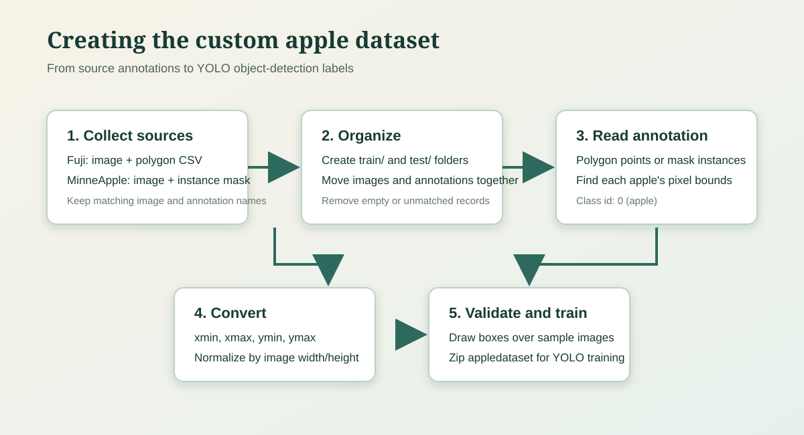

# Apple Dataset Unification

This project creates a custom apple object-detection dataset in YOLO format from two annotation types:

- Fuji images with VIA-style polygon annotations stored in CSV files.
- MinneApple images with instance-segmentation masks.

The notebooks convert both sources into the same detection format. The result is one class, `apple`, with class id `0`.



## Dataset creation method

The word “curing” in the original request is treated here as **creating** the custom dataset. The process is:

1. Collect the source images and their matching annotations.
2. Create `train` and `test` folders under `appledataset`.
3. Copy or move each image together with its polygon CSV or mask.
4. Read every apple annotation.
5. Calculate the tight pixel bounding box for each apple.
6. Convert the pixel box to normalized YOLO coordinates.
7. Save one `.txt` label file for each image.
8. Draw the generated boxes on sample images to check the labels.
9. Zip the finished dataset when it is ready for model training.

This conversion intentionally creates **bounding-box detection** labels. It does not preserve the original polygon or instance-mask shape.

## YOLO conversion

For a polygon, the notebooks use the smallest rectangle containing all polygon points:

```text
x_min = min(all_points_x)    x_max = max(all_points_x)
y_min = min(all_points_y)    y_max = max(all_points_y)
```

The rectangle is normalized using the image width `W` and height `H`:

```text
x_center = ((x_min + x_max) / 2) / W
y_center = ((y_min + y_max) / 2) / H
width    = (x_max - x_min) / W
height   = (y_max - y_min) / H
```

Each output line has the YOLO format:

```text
class_id x_center y_center width height
```

Example:

```text
0 0.512500 0.430000 0.180000 0.220000
```

All coordinates are between `0` and `1`. Very small or degenerate boxes are skipped. For mask data, background pixels have value `0`; each non-zero instance value is converted to one bounding box.

## Notebooks

### Fuji polygons

Open [Fuji_polygon_to_yolo_conversion.ipynb](Fuji_polygon_to_yolo_conversion.ipynb) and run the cells in order. The notebook:

- Creates the `appledataset/train` and `appledataset/test` directories.
- Moves Fuji validation images and CSV annotations into the test folder.
- Reads `mask__<image-name>.csv` files and their `region_shape_attributes` polygon data.
- Finds the matching image for each CSV file.
- Writes labels to `appledataset/train/yolo_labels` or `appledataset/test/yolo_labels`.
- Visualizes generated boxes for a manual check.

### MinneApple masks

Open [mineapple_to_yolo_conversion.ipynb](mineapple_to_yolo_conversion.ipynb) and run the cells in order. The notebook:

- Reads images from `detection/train/images` and masks from `detection/train/masks`.
- Treats each unique non-zero mask value as one apple instance.
- Finds the matching image, extracts the instance bounds, and normalizes them.
- Moves the images and generated labels into `appledataset/train`.
- Creates `appledataset.zip` after conversion.

The original Fuji and MinneApple source folders are external inputs and are not included in this repository.

## Setup

Use Python 3.9 or newer and select the project virtual environment as the notebook kernel:

```powershell
python -m venv venv
.\venv\Scripts\Activate.ps1
python -m pip install --upgrade pip
pip install -r requirements.txt
```

Launch Jupyter or open either notebook directly in VS Code:

```powershell
jupyter notebook
```

Required packages include NumPy, pandas, OpenCV, Pillow, Matplotlib, and the notebook runtime. The exact versions are listed in [requirements.txt](requirements.txt).

## Output layout

The current dataset uses images and labels in the same split directory, with labels in a subdirectory:

```text
appledataset/
├── train/
│   ├── <image files>
│   └── yolo_labels/
│       └── <image-stem>.txt
└── test/
	├── <image files>
	└── yolo_labels/
		└── <image-stem>.txt
```

The image and label must have the same stem. For example:

```text
train/_MG_3004_02.jpg
train/yolo_labels/_MG_3004_02.txt
```

The label file contains one line per apple. Empty label files are possible when an annotation file contains no valid apple region.

## Validation checklist

Before training a model, verify that:

- Every image has the expected matching label file.
- Every label line has exactly five values.
- The class id is `0`.
- Coordinates and dimensions are within the range `0` to `1`.
- Boxes are visible and correctly placed in the notebook visualization.
- Train and test images do not overlap.

The repository snapshot currently contains 901 training images and 901 training labels. The test folder contains 388 images; generate its labels with the Fuji test conversion cells when test annotations are available.

## Archive the dataset

The Fuji notebook includes the following final step:

```python
shutil.make_archive("appledataset", "zip")
```

This creates `appledataset.zip` for transfer to a YOLO training workflow. The archive is ignored by Git because it is a generated data artifact.
